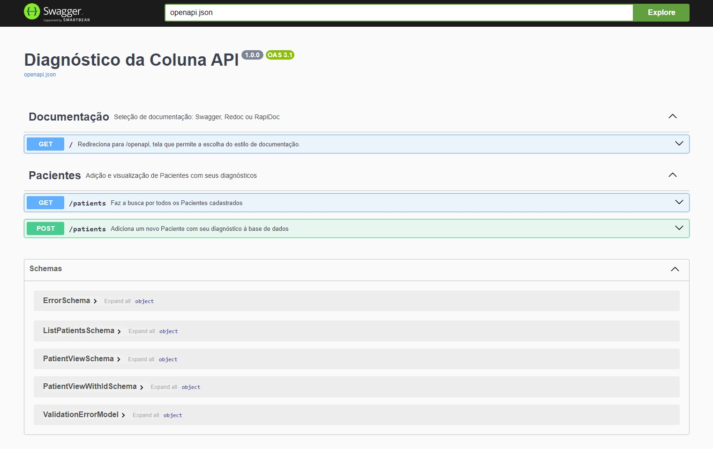

# API - Diagnóstico da Coluna

A **API - Diagnóstico da Coluna** fornece um serviço que diz se um paciente tem ou não algum problema de Hernia de Disco ou Espondilolistese.

Principais funcionalidades:
- **Cadastro de paciente**: cadastro do paciente que com base nos dados passados o sistema informa o diagnóstico;
- **Listagem dos pacientes**: lista os pacientes com seus respectivos resultados;



---
## Tecnologias e Arquitetura
- **Flask**: micro-framework python;
- **SQLite3**: banco de dados;
- **MVC**: modelo arquitetural amplamente utilizado e de fácil implementação;
- **Pytest**: para os testes unitários;
- **Documentação**: atráves da lib `flask-openapi3` temos aqui uma rica documentação, podende ser: Swagger, ReDoc ou RapiDoc.

---
## Execução da Api

Primeiramente temos que instalar as libs presentes em `requirements.txt` com o seguinte comando:
  ```
  pip install -r requirements.txt
  ```
Depois que as libs foram instaladas, podemos executar o projeto com o comando:
  ```
  flask run --host 0.0.0.0 --port 5000
  ```
  ou em modo de desenvolvimento:
  ```
  flask run --host 0.0.0.0 --port 5000 --reload
  ```

Abra o [http://localhost:5000/](http://localhost:5000/) no navegador para verificar o status da API em execução.